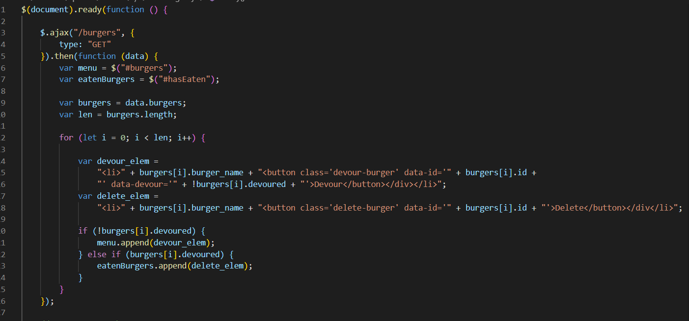

# nibbler
Eat-Da-Burger!

Nibbler is a burger logger with MySQL, Node, Express and a homemade ORM architected with MVC.

### Prerequisites

You will need to install the following to make your own Proxy:

```

   * [npm install express]
   * [npm install mysql]
   
```

### How To Use Nibbler

1. Go to link: https://pure-coast-87910.herokuapp.com/
2. Add a burger.
3. You will see your burger under menu. 
4. You will have the option to "devour" the burger.
5. Once "devoured," you can delete the burger.

**Sample Code**



## Created By

* **Amiel Nicdao** 

**For Express/SQL/MVC homework**

## Technologies

* Javascript
* jQuery
* Node.js
* Dependencies:
    * express
    * MYSQL
* Heroku

## Acknowledgments

* Instructor
* TAs
* Classmates

